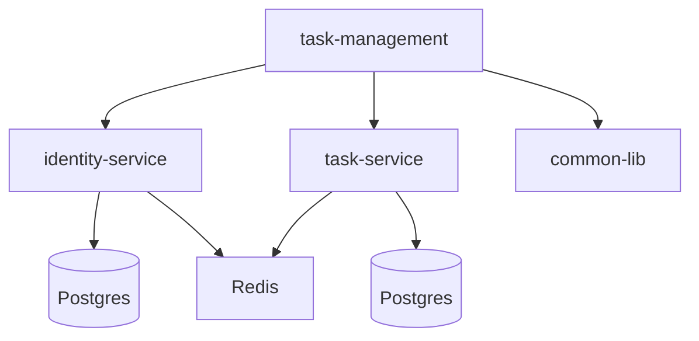

## Architecture


## How to Run
* Build project: Run the following command from root.

```
mvn clean install -DskipTests

```
* Run all the services via Docker compose

   - Run all the services (Simplest)
      ```
      docker-compose --env-file .env up --build
      ```
* Alternately, Run only postgres, pgadmin, and redis services using docker

  ```
  docker-compose --env-file .env up --build postgres pgadmin redis
  ```
     - Run identity-service, task-service, and api-gateway using Intellij

------
## Useful Docker commands

* To **Stop and remove** All Containers, but not volumes or images

```bash
docker-compose down
```

* Running in detached mode:

```bash
docker-compose --env-file .env up -d
```

* If code or Dockerfiles have been changed, use `--build` in the command.

```bash
docker-compose --env-file .env up -d --build
```

* If you ever want to remove everything (containers, networks, volumes):

```bash
docker-compose down -v
```

* To Check Status of Running Containers

```bash
docker ps
```

* And to see logs for a service:

```bash
docker logs identity-service
```

* To stream logs live:

```bash
docker-compose logs -f
```

## Connect to Database using DBeaver
* Open DBeaver → Database > New Connection.
* Choose PostgreSQL.
* Fill details:
  - Host: localhost
  - Port: 5432 
  - Database: keep empty and tick the checkbox "Show all Databases"
  - Username: value of ${POSTGRES_USER} 
  - Password: content of secrets/postgres_password.txt
* Test connection and Save.
* To access PgAdmin, use URL http://localhost:6070/browser/ with credentials defined in .env file.

## API Documentation
* API Gateway Swagger URL: http://localhost:8070/swagger-ui/index.html
* Identity-Service Swagger URL: http://localhost:8081/swagger-ui/index.html
* Task-Service Swagger URL: http://localhost:8082/swagger-ui/index.html

## Project Documentation
* [API-Gateway] (docs/api-gateway.md)
* [Logging Implementation] (docs/Logging_implementation.md)
* [RBAC Implementation] (docs/RBAC_implementation.md)
* [Secret Management] (docs/secret_management.md)
* [Task-Service Design] (task-service/docs/design.md)