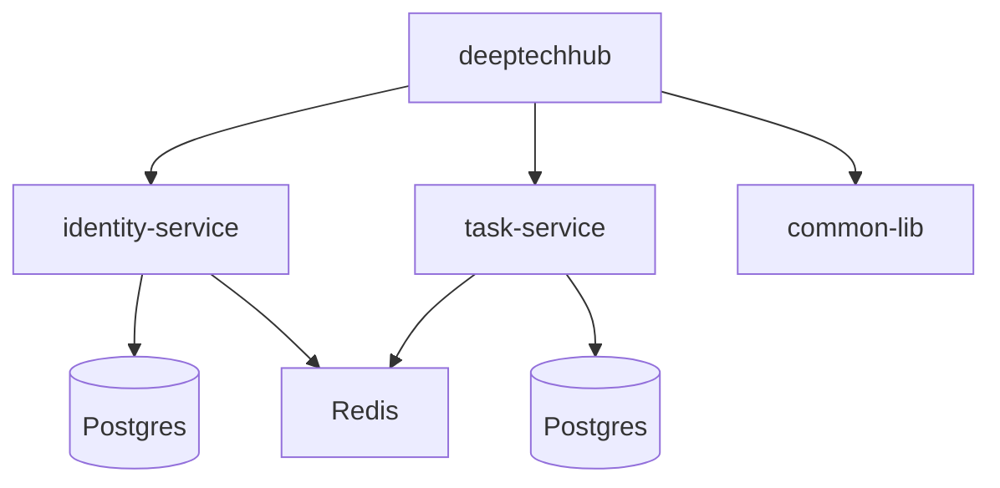

## Architecture


## Steps to Run
1. Build JARs with correct manifest:

```
mvn clean install -DskipTests

```
2. Run services via Docker compose

   - Run all the services (Simplest)
      ```
      docker-compose --env-file .env up --build
      ```
   - Alternately, Run only postgres, pgadmin, and redis services using docker
      ```
      docker-compose --env-file .env up --build postgres pgadmin redis
      ```
     - Run identity-service and task-service using Intellij
     - Add following VM Option in Intellij `-Dspring.profiles.active=local`

------
## Useful Docker commands

* To **Stop and remove** All Containers, but not volumes or images

```bash
docker-compose down
```

* Running in detached mode:

```bash
docker-compose --env-file .env up -d
```

* If code or Dockerfiles have been changed, use `--build` in the command.

```bash
docker-compose --env-file .env up -d --build
```

* If you ever want to remove everything (containers, networks, volumes):

```bash
docker-compose down -v
```

* To Check Status of Running Containers

```bash
docker ps
```

* And to see logs for a service:

```bash
docker logs identity-service
```

* To stream logs live:

```bash
docker-compose logs -f
```

## Connect to Database using DBeaver
* Open DBeaver → Database > New Connection.
* Choose PostgreSQL.
* Fill details:
  - Host: localhost
  - Port: 5432 
  - Database: keep empty and tick the checkbox "Show all Databases"
  - Username: value of ${POSTGRES_USER} 
  - Password: content of secrets/postgres_password.txt
* Test connection and Save.
* To access PgAdmin, use URL http://localhost:6070/browser/ with credentials defined in .env file.
