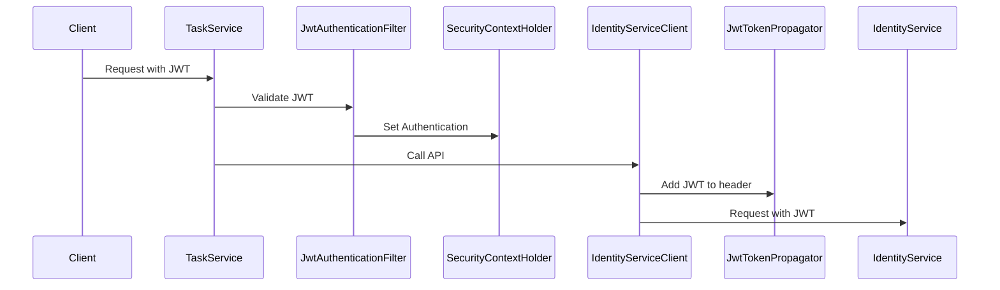

## User authentication Flow

```mermaid
sequenceDiagram
    participant Client
    participant TaskService
    participant JwtAuthenticationFilter
    participant SecurityContextHolder
    participant IdentityServiceClient
    participant JwtTokenPropagator
    participant IdentityService

    Client->>TaskService: Request with JWT
    TaskService->>JwtAuthenticationFilter: Validate JWT
    JwtAuthenticationFilter->>SecurityContextHolder: Set Authentication
    TaskService->>IdentityServiceClient: Call API
    IdentityServiceClient->>JwtTokenPropagator: Add JWT to header
    IdentityServiceClient->>IdentityService: Request with JWT


```

